# ⏰ Phii

**Gemini powered grouped alarms, smooth animations, and everything nice — Phii, a modern Flutter-based alarm app built for precision, calm, and control.**

[](https://flutter.dev/)
[](https://dart.dev/)
[](https://ai.google.dev/)
[](https://docs.hivedb.dev/)
[](https://m3.material.io/)
[](LICENSE)

## ✨ Features

- **🎙️ Voice Commands**: Control alarms with natural voice commands powered by Gemini AI
- **📁 Grouped Alarms**: Organize alarms into profiles (work, weekend, gym, etc.)
- **🎨 Beautiful UI**: Smooth animations and modern Material 3 design
- **⏱️ Flexible Scheduling**: Set alarms at specific times or durations from now
- **🔔 Ring Testing**: Test your alarm sounds instantly
- **🗣️ Text-to-Speech**: Get audio feedback for your commands
- **🌙 Dark Mode**: Full theme support for day and night

## 🎤 Voice Commands

Phii supports natural voice commands including:

- "Set alarm for 7 AM"
- "Wake me up in 30 minutes"
- "Stop all alarms"
- "Create profile work"
- "Ring now"
- "Show my alarms"
- "Delete all profiles"

## 📥 Downloads

[](https://github.com/virajjiwane/phii/releases/latest)
[](https://github.com/virajjiwane/phii/releases)

| Platform | Download | Status |
|----------|----------|--------|
| 🤖 Android | [Download APK](https://github.com/virajjiwane/phii/releases/latest) | ✅ Available |
| 🍎 iOS | Coming Soon | ⏳ Pending |

### Security Note
This APK is currently unsigned for testing purposes. A production-signed 
version will be published to Google Play Store soon.

## 📈 Stats


## 🚀 Getting Started

## 🎬 Demo Video

[](https://youtu.be/ycxgpHq8i14)

👆 Click to watch the full demo

### Prerequisites

- Flutter SDK (latest stable)
- Android Studio / Xcode for mobile development
- Gemini API key for voice command processing

### Installation

1. Clone the repository:
```bash
git clone https://github.com/virajjiwane/phii.git
cd phii
```

2. Install dependencies:
```bash
flutter pub get
```

3. Run the app:
```bash
flutter run
```

## 🏗️ Architecture

Phii follows a clean architecture with separation of concerns:

- **Services**: Business logic for alarms, profiles, and commands
  - `AlarmService`: Alarm CRUD operations
  - `ProfileService`: Profile management
  - `CommandHandlerService`: Voice command execution
  - `SpeechService`: Speech recognition
  - `GeminiSpeechService`: AI-powered command parsing

- **Models**: Data structures (Profile, SpeechCommand)
- **Screens**: UI components (HomeScreen, ProfileScreen, EditAlarmScreen)
- **Widgets**: Reusable UI components

## 🛠️ Built With

- [Flutter](https://flutter.dev/) - UI framework
- [Hive](https://docs.hivedb.dev/) - Local database
- [Alarm Package](https://pub.dev/packages/alarm) - Alarm scheduling
- [Speech to Text](https://pub.dev/packages/speech_to_text) - Voice recognition
- [Google Fonts](https://pub.dev/packages/google_fonts) - Typography
- [Gemini AI](https://ai.google.dev/) - Natural language processing

## 📱 Screenshots

<div align="center">

### Home Screen
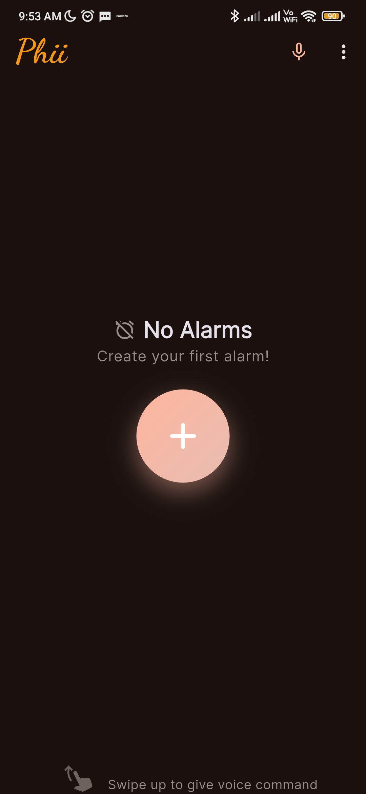

### Profile List
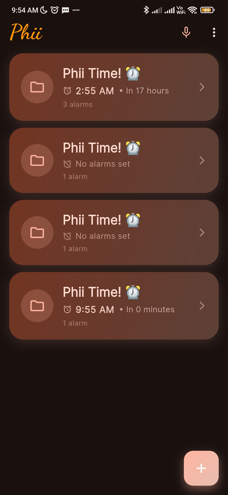

### Alarms List
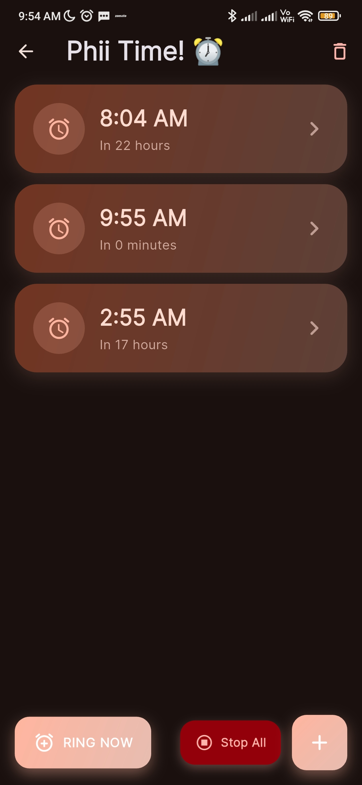

### Edit Alarm
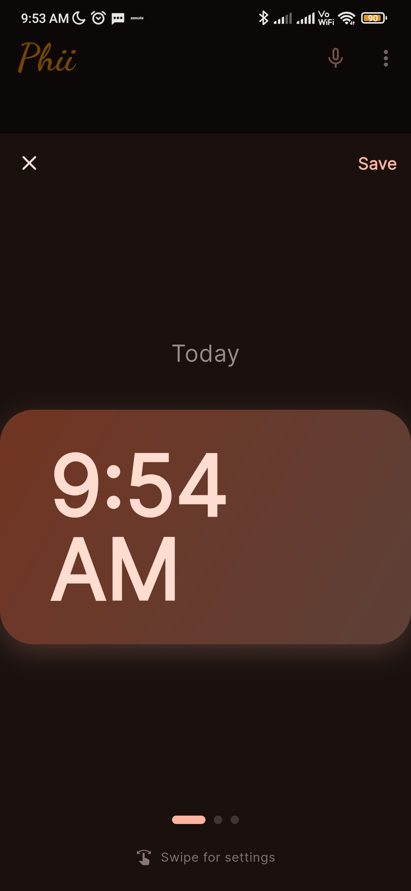

### Set Time
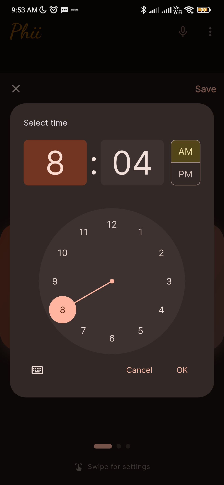

### Voice Commands
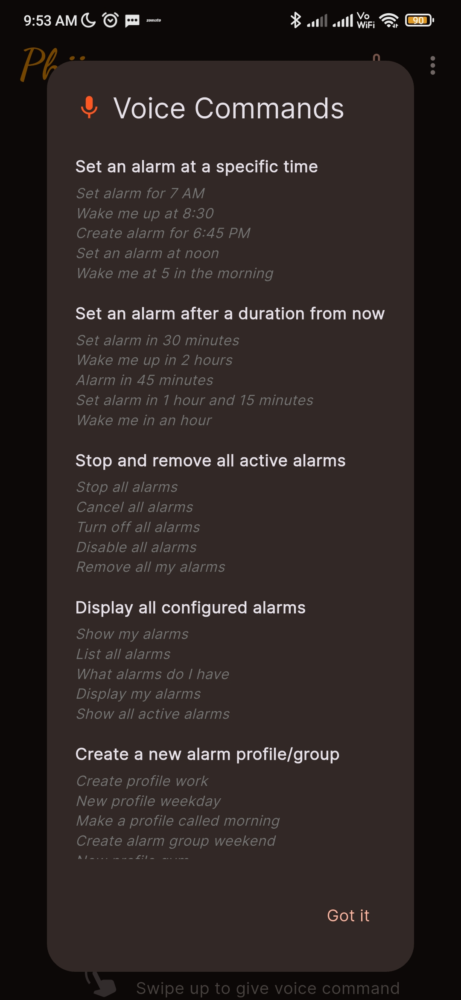

### Alarm Ringing
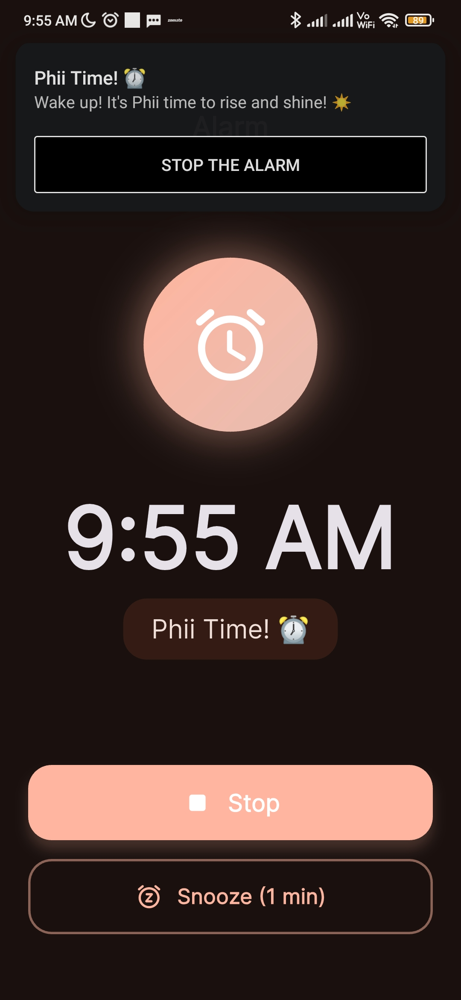

### Audio Settings
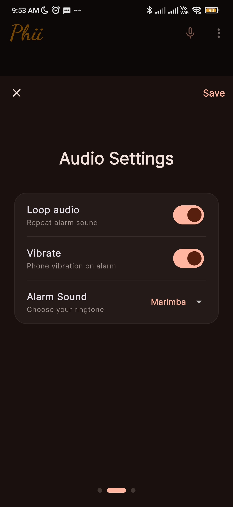

### Volume Settings
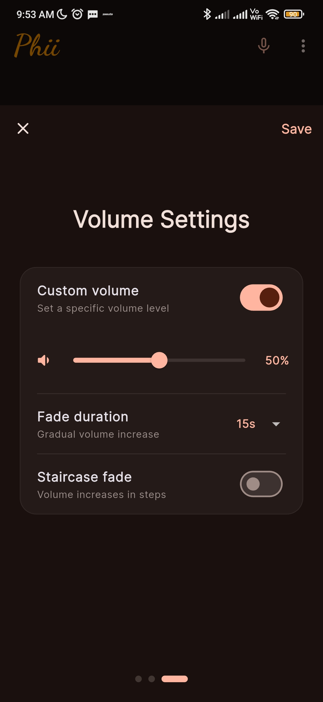

### App Settings
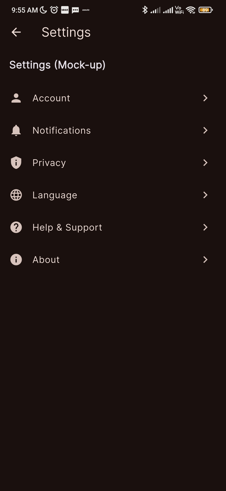

### Test Ringing
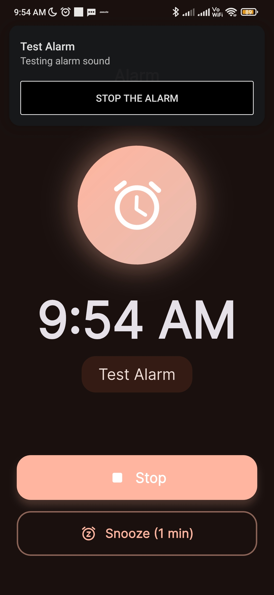

</div>

## 📝 License

This project is licensed under the MIT License - see the [LICENSE](LICENSE) file for details.

## 👨‍💻 Author

**Viraj Jiwane**
- GitHub: [@virajjiwane](https://github.com/virajjiwane)
